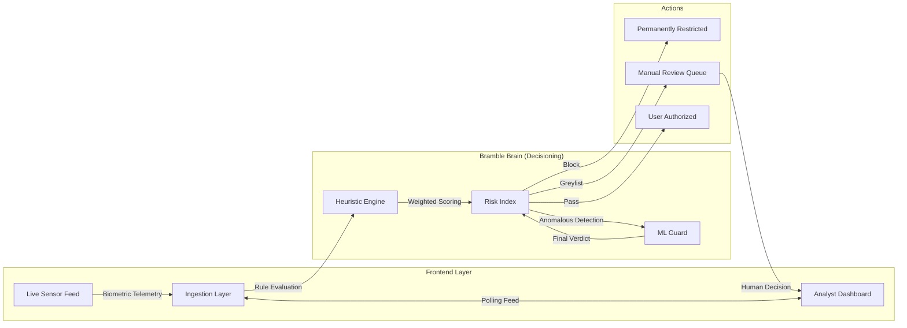

# Bramble

Bramble is a real-time behavioral defense engine designed to stop sophisticated bots and fraudulent actors at the point of entry. Unlike traditional security that relies on intrusive CAPTCHAs, Bramble uses **Invisible Biometrics** and **Heuristic Risk Scoring** to protect your platform without compromising user experience.

---

## System Architecture



---

## The Bramble Risk Model

Bramble employs a **Hybrid Intelligence** approach to scoring risk, combining deterministic rules with behavior-based anomaly detection.

### 1. Deterministic Heuristics (The Tier 1 Guard)
The first layer of defense evaluates high-confidence "smoking gun" signals:
*   **IP Velocity**: Tracking request bursts per minute (100% block on flood detection).
*   **Persistent Fingerprinting**: Matching device "DNA" against known adversarial clusters.
*   **ID Entropy**: Statistical analysis of email and username strings to identify 0-day random generation scripts.

### 2. Behavioral ML (The Biometric Layer)
Bramble analyzes the "how" of a signup, not just the "what." This layer focuses on **Latency Anomaly Detection**:
*   **Typing Rhythms (Keystroke Dynamics)**: Humans have variable rhythms. Bots type with "perfect" mechanical cadence or inhuman speed. Bramble flags high-speed patterns (> 500ms password entry) as `BOT_TYPING`.
*   **Input Integrity**: The system tracks `Paste` events in unique fields. While humans paste passwords, they rarely paste their own phone number or first name. 
*   **Contextual Sizing**: Measuring focus shifts and session duration. A 500ms session that results in a 10-field form completion is mathematically improbable for a human.

### 3. Isolation & Scoring
Signals contribute to a cumulative score (0-100).
*   **0 - 30 (Trusted)**: Minimal risk signals.
*   **31 - 70 (Suspicious)**: "Greylisted." Promoted to the Analyst Queue.
*   **71 - 100 (High Risk)**: Auto-blocked. Device fingerprint added to local blacklist.

---

## 🚀 Local Development

To run Bramble on your local machine, ensure you have **Node.js 18+** installed.

### 1. Installation
```bash
npm install
```

### 2. Configure Environment
Create a `.env` file (see `.env.example` for reference):
```bash
cp .env.example .env
```

### 3. Start Development Server
```bash
npm run dev
```
The application will be available at `http://localhost:3000`.

---

## 🔌 API Reference

### User Operations
| Endpoint | Method | Description |
| :--- | :--- | :--- |
| `/api/v1/signup-event` | `POST` | Ingests behavioral telemetry from the signup form. |

### Analyst Dashboard
| Endpoint | Method | Description |
| :--- | :--- | :--- |
| `/api/v1/events` | `GET` | Returns 50 most recent risk verdicts. |
| `/api/v1/stats` | `GET` | Returns aggregate statistics (Blocked, Greylisted, Passed). |
| `/api/v1/review/:eventId` | `PUT` | Manually `block` or `clear` a greylisted session. |

### Developer Tools
| Endpoint | Method | Description |
| :--- | :--- | :--- |
| `/api/v1/simulate` | `POST` | Injects synthetic traffic (`bot`, `velocity`, or `random`). |
| `/api/health` | `GET` | Basic system health check. |

---

## Security Indicators
Bramble evaluates sessions against several "Indicators of Risk":

*   **BOT_TYPING**: Typing cadence faster than human physical limits (< 400ms interval).
*   **PASTE_DETECTED**: User pasted data into unique fields (commonly used by account-creation scripts).
*   **IP_VELOCITY**: High volume of requests coming from a single IP in a short window.
*   **HIGH_EMAIL_ENTROPY**: Email address matches patterns typical of random string generators.
*   **REPEAT_FINGERPRINT**: Device matches an entry already on the permanent blacklist.

---

## Simulation Testing
Use the **Global Controls** panel in the Analyst Dashboard to trigger synthetic attacks and observe how the Risk Brain calculates scores and updates the Log in real-time.
